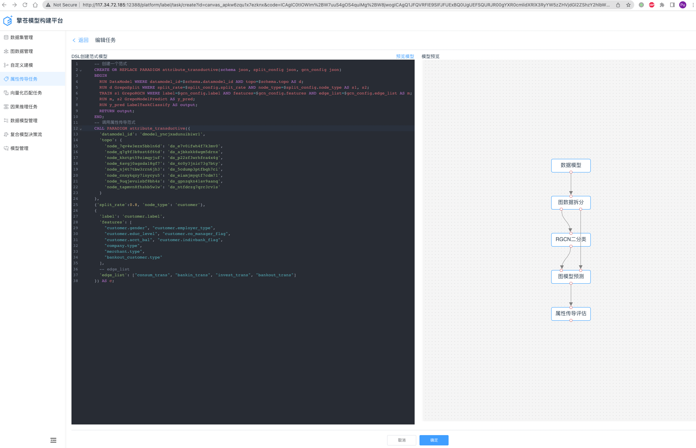

# slht-fgl-lite
* FGL 范式化建模语言开源轻量版
# fgl 项目参考 
https://e.gitee.com/slht/repos/slht/graphaidsl

## 目录说明 
* fgl FGL语法支持
* interpreter FGL语法解释器
* interpreter/engine_adapters 针对不同计算引擎的适配器
* engine 计算引擎
* libs 算子库
* examples 样例

## 测试用例说明(examples)
* test_data_topo 基于数据模型的 属性传导测试用例(当前平台支持，lite版需要废弃)  
* test_data_graph 基于上传文件/内置图数据集的 属性传导测试用例(lite版的使用方法)   
## 测试说明教程
1. git submodule update --init  
2. python3 -m pip install -r graphaidsl/fgl/requirements.txt    
3. python3 examples/test_data_topo.py   
4. python3 examples/test_data_graph.py   

