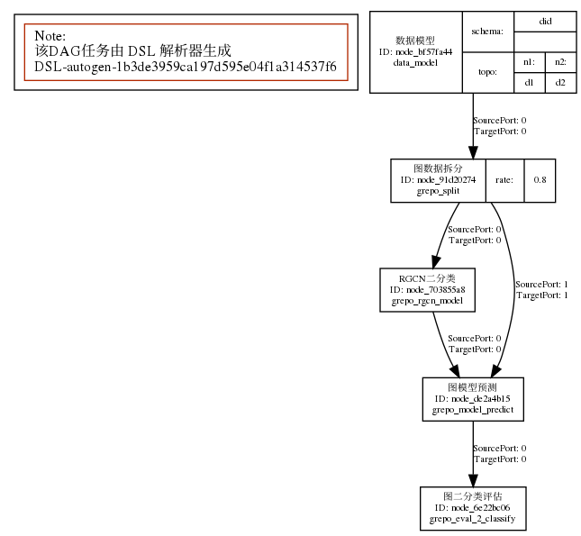
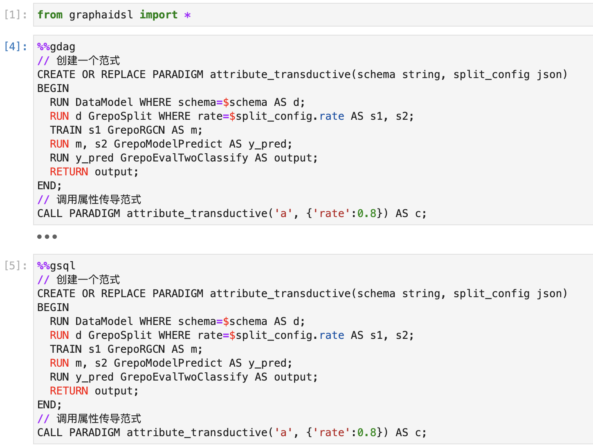

# FGL

* parser Antlr4 实现的解析器
*  interpreter 解释器服务
* LSP (Language Service Provider) 服务

## 介绍  
基于 Antlr4 实现的FGL解析器

## 最佳实践(examples)
**需安装 vscode extension [flg-lang](https://marketplace.visualstudio.com/items?itemName=hp027.fgl-lang) 插件** 
| 文件 |内容 |  
| --- | --- |  
|best_practice.fglnb |最佳实践 | 
|crud.fglnb | 基础的CRUD命令|
|notebook_render.fglnb | 支持的notebook Cell渲染模式| 
| submode.fglnb | magic子命令| 

## 环境依赖
* [安装 antlr tools && antlr runtime](https://www.antlr.org/)
* pip install -r graphaidsl/requirements.txt  

## 项目开发  
```sh
make build # antlr4 编译 g4 模板
make test # 测试
make interpreter # 启动demo解释器
```

## 测试用例
***make test***  执行全部测试

|测试文件|用例说明|
| --- | --- |
| test/test_formatdag|dag, dot, svg 输出格式|
| test/test_interpreter | 后端解释器 |
| test/test_parser | FGL语法特性 |


## FGL解析过程   
1. FGL 语句  
2. Antlr4 词法语法分析  
    - Token 词法分析   
    - Rule 语法分析   
3. Visitor 模式遍历ParserTree   
    - DDL + DML 分离  
    - 变量检查  
    - Macro 改写  
    - 生成 DAG 物理计划  
4. 项目执行DAG(eg: 使用说明)


## 使用说明
```python
    from fgl import FGL
    # A -> B -> C
    stat = '''
    // 创建一个范式
    CREATE OR REPLACE PARADIGM attribute_transductive(schema json, split_config json)
    BEGIN
      RUN DataModel WHERE schema=$schema.did AND topo=$schema.topo AS d;
      RUN d GrepoSplit WHERE rate=$split_config.rate AS s1, s2;
      TRAIN s1 GrepoRGCN AS m;
      RUN m, s2 GrepoModelPredict AS y_pred;
      RUN y_pred GrepoEvalTwoClassify AS output;
      RETURN output;
    END;
    // 调用属性传导范式
    CALL PARADIGM attribute_transductive({'did': 'did', 'topo':{'n1':'d1', 'n2':'d2'}}, {'rate':0.8}) AS c;
    '''
    dag = FGL().parse_dag(stat, dumps=True)
    print(dag)
```
## DAG 可视化


## DAG 解析结果
```json
{
    "version": "1.0.0",
    "canvas": {
        "name": "DSL-autogen-88b498c1ffa6ad5c18e124036c412a44",
        "description": "该DAG任务由 DSL 解析器生成",
        "position": "dsl"
    },
    "nodes": [
        {
            "id": "node_38039546",
            "name": "DataModel",
            "module_id": "data_model",
            "node_attrs": {
                "schema": "a",
                "module": "数据模型"
            }
        },
        {
            "id": "node_0eb37901",
            "name": "GrepoSplit",
            "module_id": "grepo_split",
            "node_attrs": {
                "rate": 0.8,
                "module": "图数据拆分"
            }
        },
        {
            "id": "node_9e85ac1f",
            "name": "GrepoRGCN",
            "module_id": "grepo_rgcn_model",
            "node_attrs": {
                "module": "RGCN二分类"
            }
        },
        {
            "id": "node_82fba3f2",
            "name": "GrepoModelPredict",
            "module_id": "grepo_model_predict",
            "node_attrs": {
                "module": "图模型预测"
            }
        },
        {
            "id": "node_c915005a",
            "name": "GrepoEvalTwoClassify",
            "module_id": "grepo_eval_2_classify",
            "node_attrs": {
                "module": "图二分类评估"
            }
        }
    ],
    "edges": [
        {
            "source": "node_38039546",
            "target": "node_0eb37901",
            "source_port": 0,
            "target_port": 0
        },
        {
            "source": "node_0eb37901",
            "target": "node_9e85ac1f",
            "source_port": 0,
            "target_port": 0
        },
        {
            "source": "node_0eb37901",
            "target": "node_82fba3f2",
            "source_port": 1,
            "target_port": 1
        },
        {
            "source": "node_9e85ac1f",
            "target": "node_82fba3f2",
            "source_port": 0,
            "target_port": 0
        },
        {
            "source": "node_82fba3f2",
            "target": "node_c915005a",
            "source_port": 0,
            "target_port": 0
        }
    ]
}
```

## Jupyter MAGIC 支持
